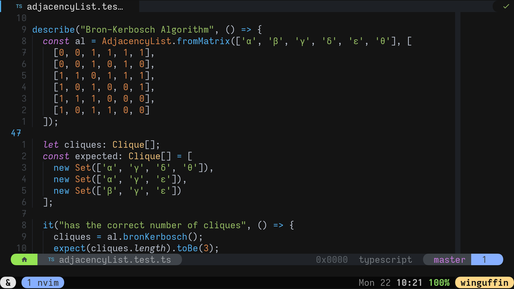
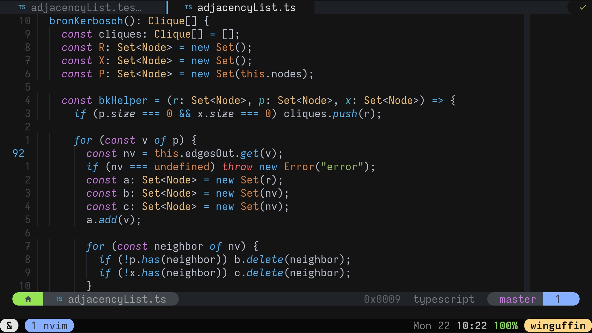
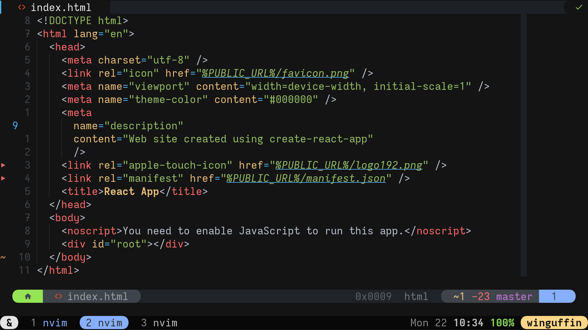

# Glowbeam the colorscheme 👉 👉

## About

This is my personal colorscheme that I have been working on for a while and
always wanted to make it openly available, so here it is! A lot of the colors
are inspired from some previous colorschemes I used many years ago like
[`sjl/badwolf`](https://github.com/sjl/badwolf) and
[`josuegaleas/jay`](https://github.com/josuegaleas/jay), as well as some
JetBrains applications' colorschemes. In addition, a lot of the non-text
related colors were borrowed from [`vim-scripts/Wombat`](https://github.com/vim-scripts/Wombat)

This colorscheme used to be created entirely manually, but then a while ago I
switched to using [`Iron-E/nvim-highlite`](https://github.com/Iron-E/nvim-highlite).
Now, we have migrated to the amazing [`rktjmp/lush.nvim`](https://github.com/rktjmp/lush.nvim)
(such an amazing plugin by the way, thank you [@rktjmp](https://github.com/rktjmp) and community!)

## Installation

You probably know how this works by now, but here is an example anyway:

- packer.nvim
```lua
use "cooper-anderson/glowbeam.nvim"
```

- vim-plug
```vim
Plug "cooper-anderson/glowbeam.nvim"
```

## Screenshots

- A typescript example:

- Some more typescript:

- And some html as well:


## Notes

- Because of the recent switch to Lush, I removed a bunch of specifically
		tailored rules for some filetypes, but those should be added back in time
		as I find the need for them
- So far I have only tested this colorscheme with `termguicolors` enabled, so
		keep that in mind

## Extra

Here are some plugins that are visible in the screenshots:

 Thing     | Repository
-----------|------------
Statusline | [`glepnir/galaxyline.nvim`](https://github.com/glepnir/galaxyline.nvim)
Bufferline | [`akinsho/nvim-bufferline.lua`](https://github.com/akinsho/nvim-bufferline.lua)
Git Signs  | [`lewis6991/gitsigns.nvim`](https://github.com/lewis6991/gitsigns.nvim)
Intelligent highlighting | [`nvim-treesitter/nvim-treesitter`](https://github.com/nvim-treesitter/nvim-treesitter)
Bar at the very bottom | [`tmux/tmux`](https://github.com/tmux/tmux) (not really a vim plugin, but)

